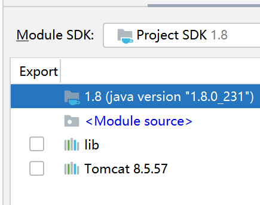

# Posts (添加图片上传功能)

## 前情回顾

<pre>
    1. GET 请求，参数是放在 URL 地址栏中发送到服务器的 /xxx?id=3&name=444
    2. POST 请求，参数是放在请求体中发送的，所以地址栏看不到数据
    3. enctype 表示数据的传输格式:
       - application/x-www-form-urlencoded: id=3&name=3333
       - multipart/form-data，表示数据将会被分段处理之后再发送
</pre>

## 预备知识

<pre>
    HTML 中用来跟文件系统进行交互的手段只有一个:
    - input type=file

    如果想要上传的话:
    - 必须要用 POST 进行提交，这种方式，将会把数据封装在请求体中进行发送
    - 必须指定 enctype 为 multipart/form-data，这样数据才会被正确分段处理并上传
  - 可以通过 accept 限定只能上传哪些类型的文件
    1. accept='.jpg'
    2. accept='.jpg,.png'
    3. accept='image/jpeg'
    4. accept='image/jpeg,image/png'
    5. accept='image/*'
  - 通过 multiple 来指定可以选择多个图片进行上传
  - 可以通过 JS 结合 `URL.createObjectURL` 来实现文件的预览效果
</pre>

## 基本步骤

<pre>
    前端页面中:
    1. 写一个 form 表单，使用 POST 方法，并指定 enctype='multipart/form-data'
    2. 使用 input type=file 来选择文件

    后台接受:
    1. 要在 Servlet 上面添加 `@MultipartConfig` 注解
    2. 使用 req.getPart('name') 来接受图片
    3. 使用 part.write('路径') 来保存图片到服务器的硬盘
</pre>

## 基本配置

配置在类的上面:
```java
@MultipartConfig(
        maxFileSize = -1,
        maxRequestSize = -1,
        fileSizeThreshold = 100000000
)
```

配置在 xml 中:
```xml
    <servlet>
        <servlet-name>xxx</servlet-name>
        <servlet-class>test.UploadServlet</servlet-class>
        <multipart-config>
            <location>c:/hello</location>
            <max-file-size>23</max-file-size>
            <max-request-size>232323</max-request-size>
            <file-size-threshold>222</file-size-threshold>
        </multipart-config>
    </servlet>
    <servlet-mapping>
        <servlet-name>xxx</servlet-name>
        <url-pattern>/xxcsdf</url-pattern>
    </servlet-mapping>
```

## 其他资源

- http://commons.apache.org/proper/commons-fileupload/

## 基本问题
### `getSubmittedFileName` 找不到

- `getSubmittedFileName` 方法是从 Servlet 3.5 开始有的 (Tomcat7)
- JAVAEE6 包是没有必要的 (servlet-api.jar/jsp-api.jar)
- 在模块的依赖里面，添加 Tomcat 就可以了



## TODO

- 页面端: 限制只能发送 jpg/png 格式
- Servlet 端: 保存为正确的后缀名
- Servlet 端: 限制上传图片的大小为 2M
- 在新增文章 (post/add) 的功能中，添加一副图片做封面，并正确渲染

## 接下来的任务
#### 将整个项目使用 ajax 进行重构
#### 使用 jQuery 将整个项目进行重构
#### 使用 bootstrap 将所有样式进行重构
#### 增加分页等其他功能
#### MVVM: Vue.js/ReactJS.js/AngularJS
